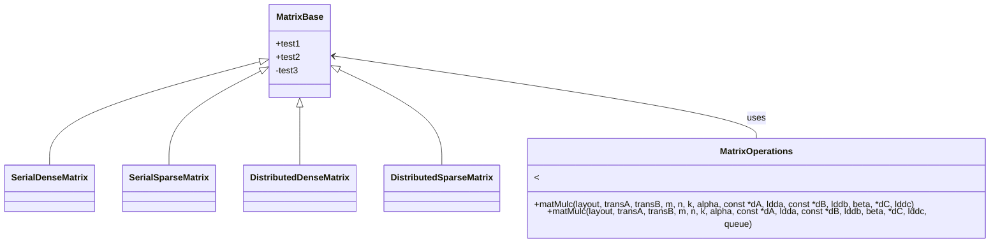

```mermaid
classDiagram
MatrixBase <|--SerialDenseMatrix
MatrixBase <|--SerialSparseMatrix
MatrixBase <|--DistributedDenseMatrix
MatrixBase <|--DistributedSparseMatrix
class MatrixBase {
+test1
+test2
-test3
}
MatrixBase<--MatrixOperations : uses
class MatrixOperations {
<<interface>
+matMulc(layout, transA, transB, m, n, k, alpha, const *dA, ldda, const *dB, lddb, beta, *dC, lddc)
+matMulc(layout, transA, transB, m, n, k, alpha, const *dA, ldda, const *dB, lddb, beta, *dC, lddc, queue)
}
```
