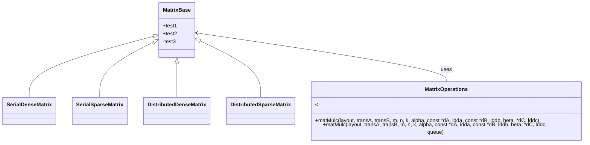

# blaspp_ex
An example for `blaspp` usage on UMich greatlakes.

## Environment
```shell
module load gcc/8.2.0
module load mkl/2018.0.4
module load openmpi/4.0.6
module load cmake/3.21.3
module load cuda/11.4.0
module load boost/1.75.0
module load git/2.20.1 
module load python/3.9.7
```

## CPU compilation
`cmake ../ -DCMAKE_C_COMPILER=mpicc -DCMAKE_CXX_COMPILER=mpicxx -DENABLE_CUDA=OFF`

## GPU compilation
`cmake ../ -DCMAKE_C_COMPILER=mpicc -DCMAKE_CXX_COMPILER=mpicxx -DENABLE_CUDA=ON`

## Class diagram doodle

